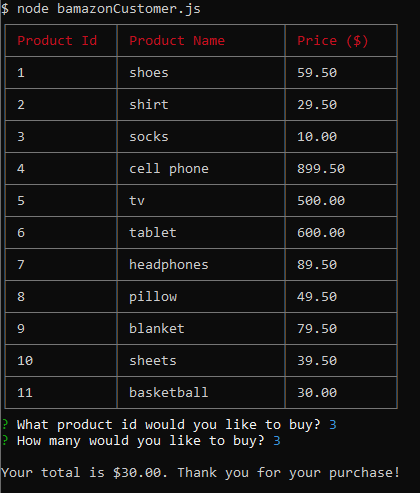
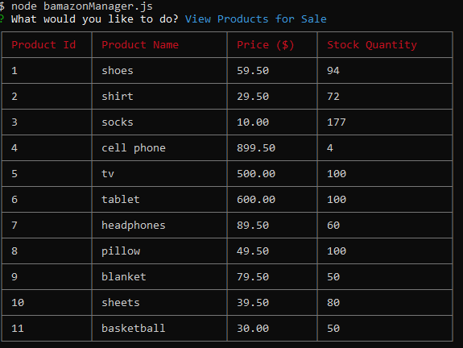
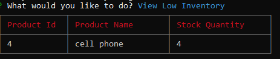
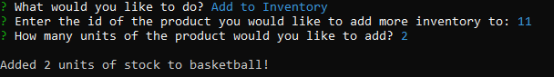
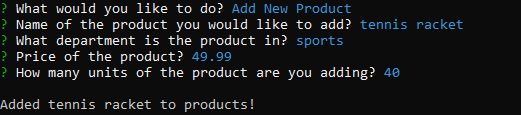
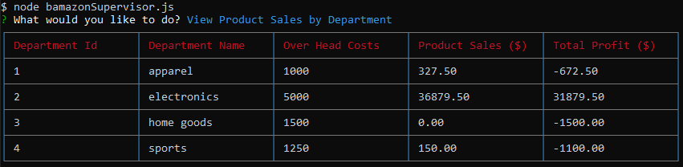
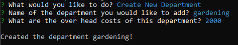

# bamazon

Bamazon is a command line Amazon-like storefront application built with Node, the Node package Inquirer, and MySQL. There are 3 components to the app which include a customer view, a manager view, and a supervisor view. The products of the store are stored in a table name `products` inside a MySQL database and each view allows users to perform different tasks by accessing the table. 

## Customer View

The customer view allows the user to purchase items in stock. Users can access the customer view by typing `node bamazonCustomer.js` in their terminal. A table with all available products is displayed and users are prompted for what product they would like to buy. After the user selects which item to buy and how many units, the order is complete and users are displayed with their total and can choose to purchase another item if they want. The MySQL database is updated after each customer order to reflect the current amount of inventory in stock.

## Manager View

Users can access the manager view by typing `node bamazonCustomer.js` in their terminal. The manager view allows users to manage the store by selecting one of the following tasks:

* View products for sale
* View low inventory
* Add to inventory
* Add a new product

#### View Products For Sale

Allows the user to view all the products for sale in the store and view their stock quantities.

#### View Low Inventory

Allows the user to view all products that have a stock quantity that have less than 5 units remaining.

#### Add To Inventory

Allows the user to add more stock quantity to a product. The user is prompted for the id of the product and how many units they want to add. When complete, the MySQL database is updated to reflect the new quantity.

#### Add New Product

Allows the user to add a new product to the store. The user is prompted for the name of the product, the department the product is in, price of the product, and how many units of inventory of the product. When complete, the MySQL database is updated to reflect the new product.

## Supervisor View

Users can access the supervisor view by typing `node bamazonSupervisor.js` in their terminal. The supervisor view allows users to create a new department and view the product sales and total profit of each department.

#### View Product Sales By Department

All products and their sales are totaled and displayed by department. Over head costs are subtracted from that total to display a total profit. A new table called `departments` was created to store the over head costs of each department. The `products` and `departments` tables are joined together to complete this task.

#### Create New Department

Allows the user to create a new department. 

